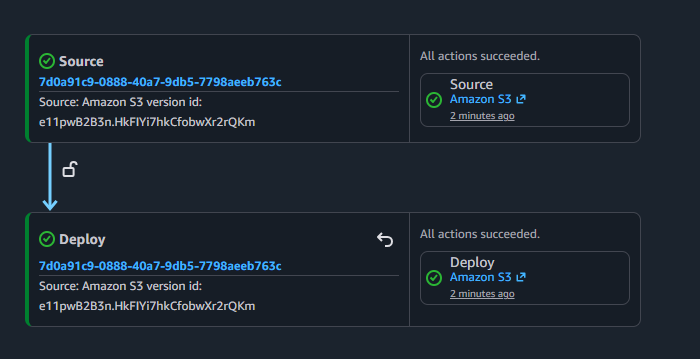

## 1. code-pipeline-website
Code Pipeline exercise to learn the basics by creating a custom two-stage pipeline that uses versioned S3 source and destination buckets for a simple HTML website.

## 2. 📌 Completed as part of this exercise.
- Built a two‑stage pipeline between versioned S3 buckets  
- Triggered the pipeline by updating the source bucket  
- Reviewed pipeline history and execution details  
- Modified the pipeline and manually triggered a new run  
- Connected GitHub to AWS Dev Tools  
- Created a pipeline linked to my GitHub repository  
- Triggered the pipeline through GitHub commits  
- Removed the pipeline after completing the exercise
- Added a remote bucket to trigger a parallel update
  
  > *NOTE:* Build and Test stages where skipped as they were not part of the exercise. They will be attempted at a later date.

## 3. 📊 Architecture Diagram (S3 Source Pipeline)

## 4. 📊 Architecture Diagram (manual-trigger-for-parallel-deployment)

## 5. 📊 Architecture Diagram (GitHub App Deployment)

## 3. 👁️ Key Takeaways from My CodePipeline Exercise
I learned that a code pipeline automates the flow of my code from source to build, test, and deployment. I now see how each stage works together—whether the source is an S3 bucket or a GitHub repository—each trigger starts the pipeline, the build stage compiles and tests my code, and deployment services release the final artifact. I also realized how crucial IAM permissions and artifacts are for keeping everything running smoothly. Overall, I feel confident in how the pieces connect to create a reliable delivery process.