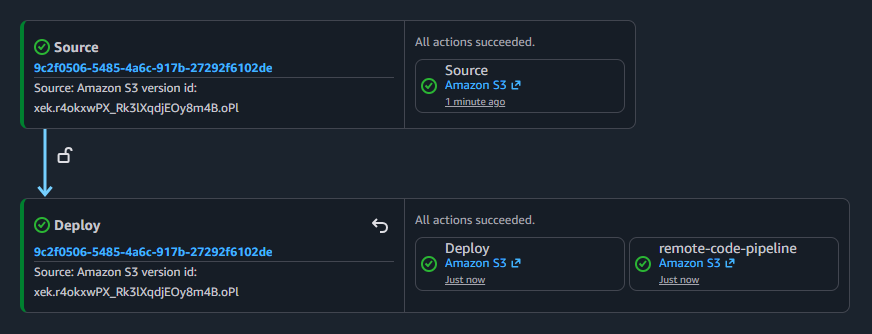
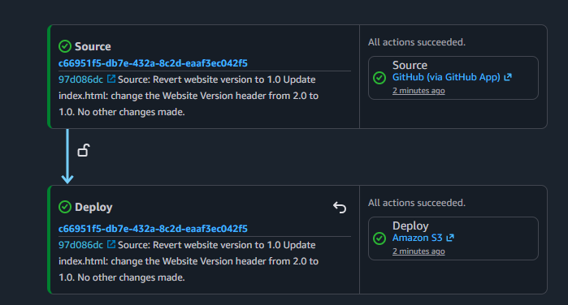

## 1. 🌐 CodePipeline Website
Code Pipeline exercise to learn the basics by creating a custom two-stage pipeline that uses versioned S3 source and destination buckets for a simple HTML website.

## 2. 📌 Completed as part of this exercise.
- Built a two‑stage pipeline between versioned S3 buckets  
- Triggered the pipeline by updating the source bucket  
- Reviewed pipeline history and execution details  
- Modified the pipeline and manually triggered a new run  
- Connected GitHub to AWS Dev Tools  
- Created a pipeline linked to my GitHub repository  
- Triggered the pipeline through GitHub commits  
- Removed the pipeline after completing the exercise
- Added a remote bucket to trigger a parallel update
  
  > *NOTE:* Build and Test stages where skipped as they were not part of the exercise. They will be attempted at a later date.

## 3. 🚀 Deployment Architecture
The following diagrams illustrate the different deployment flows supported by the platform.

### 3.1 🪣 S3 Source Pipeline

### 3.2 🪣 Manual Trigger & Parallel Deployment

### 3.3 🦑 GitHub App Deployment

## 4. ❌ Troubleshooting
During the initial pipeline setup and deployment, I encountered several configuration issues. The following section documents these issues, the troubleshooting process, and the resolutions.

### ⚠️ Issue 1: Incorrect Destination Bucket
- **Issue:** The pipeline was configured with the wrong destination bucket.
- **Investigation:** Rechecked bucket permissions, policies, and IAM roles.
- **Resolution:** Reconfigured the pipeline with the correct destination bucket and re-ran deployment.

### ⚠️ Issue 2: Incorrect ZIP File Name
- **Issue:** The pipeline was configured with an incorrect ZIP file name.
- **Investigation:** Reviewed the pipeline configuration and verified the incorrect ZIP file.
- **Resolution:** Updated the pipeline with the correct ZIP file name and re-ran pipeline.

> *Note:* I went through the long way of troubleshooting both issues before I knew I was able to edit from the pipeline screen.

## 5. 👁️ Key Takeaways
- Built and modified multi‑stage pipelines using both versioned S3 buckets and GitHub repositories, gaining hands‑on experience with different source triggers.  
- Triggered automated pipeline runs through S3 updates and GitHub commits, reinforcing how event‑based workflows initiate CI/CD processes.  
- Reviewed pipeline execution history and logs to understand how each stage processes artifacts and how AWS tracks workflow progress.  
- Manually adjusted pipeline configurations, triggered new runs, and removed pipelines after completion to practice full lifecycle management.  
- Added a remote S3 bucket to trigger parallel updates, demonstrating how pipelines can coordinate multiple sources and workflows.
-

## 6. 🔍 Exploring Next
- CodeBuild